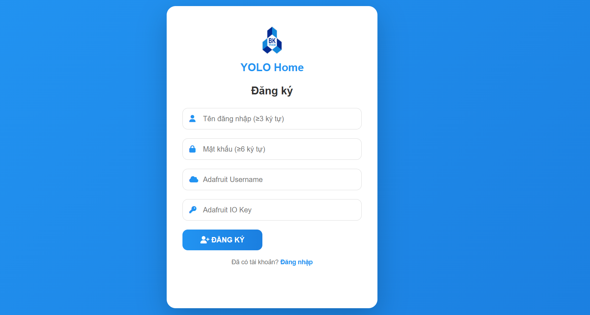
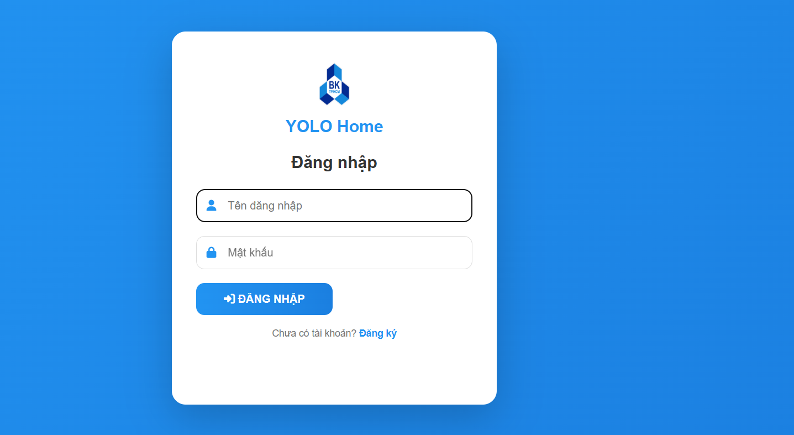
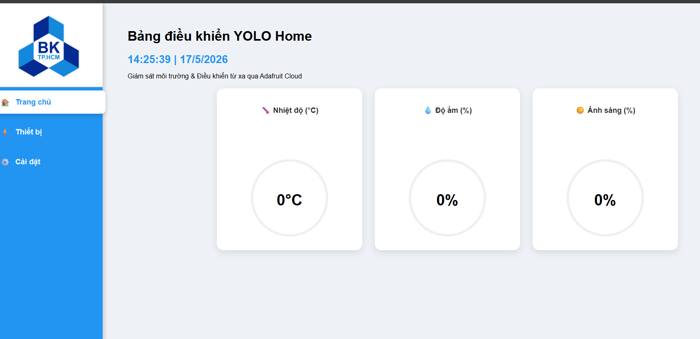
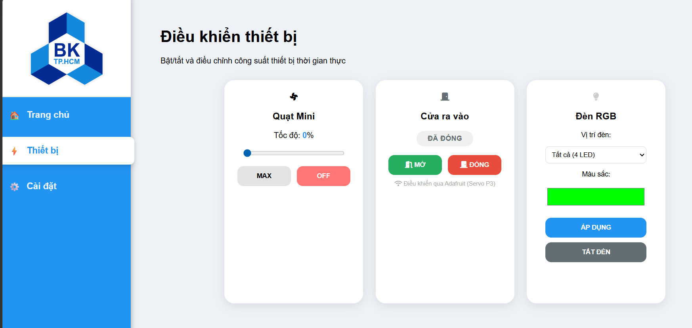
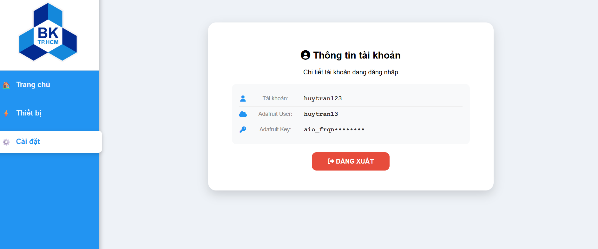

# YOLO Home — Smart Home IoT System

Smart-home monitoring and control platform built on **YoloBit (ESP32)** + **Adafruit IO** + a **FastAPI/SQLite backend** with a **web dashboard**, plus an optional **OpenCV face-recognition** module.

> 📄 Full technical report: [`docs/REPORT.md`](docs/REPORT.md)

---

## 📸 Demo

### Registration and log in page



### Home dashboard — real-time gauges

Three live gauges for temperature, humidity, and light intensity. Data is updated via MQTT WebSocket from Adafruit IO.



### Device control

Fan speed slider, door open/close (servo), and 4× RGB LED color picker — all bidirectional with the ESP32.



### Account settings

Shows the logged-in user and their (masked) Adafruit credentials.



---

## 🗂️ Project Structure

```
YoloHome/
├── README.md                   ← This file
├── .gitignore
│
├── backend/                    FastAPI + SQLite backend (serves web + APIs)
│   ├── main.py                 Entry point (runs uvicorn)
│   ├── migrate_from_json.py    One-time migration from legacy users.json
│   ├── requirements.txt
│   ├── yolohome.db             SQLite database (auto-generated, git-ignored)
│   ├── .env                    Secrets (git-ignored)
│   ├── .env.example            Template — copy to .env to start
│   └── app/                    Application package
│       ├── __init__.py         FastAPI app factory, CORS, static mount
│       ├── config.py           Loads .env (SECRET_KEY, TOKEN_DAYS, PORT)
│       ├── db.py               SQLite repository (init + CRUD)
│       ├── schemas.py          Pydantic request/response models
│       ├── auth.py             bcrypt + JWT helpers
│       └── routes.py           /api/register · /api/login · /api/me · /api/stats
│
├── esp32/                      MicroPython firmware for YoloBit
│   ├── boot.py
│   ├── main.py                 Main loop: sensors, LCD, MQTT
│   ├── config.py               WiFi & Adafruit IO credentials
│   ├── network_module.py       WiFi connection & NTP sync
│   ├── mqtt.py                 MQTT client wrapper
│   ├── coreiot_module.py       Adafruit IO setup + publish helpers
│   ├── fan_module.py           Fan PWM control
│   ├── rgb_module.py           NeoPixel RGB LED control
│   ├── door_module.py          Door servo control
│   ├── sensor_filter.py        Signal filtering
│   ├── serial_command.py
│   ├── aiot_dht20.py           DHT20 driver
│   ├── aiot_lcd1602.py         LCD1602 driver
│   └── pymakr.conf             Pymakr config
│
├── face-recognition/           Standalone OpenCV / TFLite face recognition
│   ├── AI_module.py
│   ├── face_door_unlock.py
│   ├── detector.tflite
│   └── face_dataset/
│
├── web/                        Static frontend (served by backend)
│   ├── login.html              Login & registration page
│   ├── index.html              Dashboard (requires JWT)
│   ├── assets/
│   │   └── logo.png
│   ├── css/
│   │   └── styles.css
│   └── js/
│       ├── login.js            Login/register form handler
│       └── dashboard.js        Gauges, MQTT, fan/RGB/door controls
│
└── docs/
    └── images/                 Architecture & flow diagrams
        ├── architecture.png/svg
        ├── dataflow.png/svg
        ├── boot_sequence.png/svg
        ├── module_diagram.png/svg
        ├── pymakr_workflow.png/svg
        └── screenshots/
            ├── 01-home.png
            ├── 02-devices.png
            ├── 03-settings.png
            └── 04-register.png
```

---

## 🚀 Quick Start

### Prerequisites

- **Python 3.11+** (for the backend)
- **Adafruit IO account** (free) — create one at <https://io.adafruit.com> and grab your **AIO Key** from "My Key"
- **VS Code + [Pymakr](https://marketplace.visualstudio.com/items?itemName=pycom.Pymakr)** (for flashing firmware)
- **YoloBit board** with sensors connected (DHT20, light sensor, LCD1602, fan on `pin10`, 4× NeoPixel on `pin0`)

### Run the backend + web dashboard (one command)

```bash
cd "D:/YoloHome project/backend"

# First time only:
pip install -r requirements.txt
cp .env.example .env
# Edit .env if you want a custom SECRET_KEY:
#   python -c "import secrets; print(secrets.token_urlsafe(48))"

# Every time:
python main.py
```

Console output:
```
[DB]    D:\YoloHome project\backend\yolohome.db
[WEB]   serving D:\YoloHome project\web
[USERS] 0 user(s) in database
[URL]   http://localhost:8000/
```

Open **<http://localhost:8000/>** in your browser (use `localhost`, **not** `0.0.0.0`).

You'll be redirected to `/login.html`. Click **"Đăng ký"** to register a new account — you'll need your Adafruit username and AIO Key.

### Flash firmware to YoloBit

1. Edit `esp32/config.py` and fill in your Wi-Fi + Adafruit IO credentials.
2. Open the `esp32/` folder in VS Code.
3. Connect the YoloBit via USB.
4. Run **Pymakr: Upload project** from the command palette.
5. After upload, Pymakr soft-resets the board. It connects to Wi-Fi, syncs NTP, then starts publishing sensor data to Adafruit IO every 5 seconds.

### Run face recognition (standalone, offline)

```bash
cd "D:/YoloHome project/face-recognition"
pip install opencv-python opencv-contrib-python numpy
python face_door_unlock.py
```

---

## 🌐 Backend API

Available at `http://localhost:8000/api/` once the backend is running.

| Method | Path | Auth | Description |
|---|---|---|---|
| `POST` | `/api/register` | — | Create a new user (username, password, Adafruit user, Adafruit key) |
| `POST` | `/api/login` | — | Returns a JWT token + the user's Adafruit credentials |
| `GET` | `/api/me` | Bearer | Returns current user info |
| `GET` | `/api/stats` | — | Returns total user count (debug) |

📖 Interactive API docs (Swagger UI): <http://localhost:8000/docs>

---

## 🏗️ Architecture


**Three-tier IoT architecture:**

- **Application** — Web dashboard (browser) + Face Recognizer (PC, standalone).
- **Cloud** — Adafruit IO MQTT broker (port 1883) and REST API v2.
- **Device** — YoloBit ESP32 running MicroPython, interfacing with sensors and actuators.

The browser dashboard uses **MQTT over WebSocket** (`wss://io.adafruit.com/mqtt`) to receive real-time updates from the device with zero polling overhead. Control commands are sent via REST POST.

See [`docs/REPORT.md`](docs/REPORT.md) for a deep dive into each module, including code walkthroughs and design decisions.

---

## ☁️ Adafruit IO Feeds

| Feed | Direction | Format | Description |
|---|---|---|---|
| `temperature` | YoloBit → Cloud | float (°C) | Ambient temperature |
| `humidity` | YoloBit → Cloud | float (%) | Relative humidity |
| `light` | YoloBit → Cloud | int (0–100) | Light intensity |
| `fan-speed` | Cloud ↔ YoloBit | int (0–100) | Fan PWM setpoint |
| `led-rgb` | Web → YoloBit | `#RRGGBB` / `IDX:#RRGGBB` / `0` | NeoPixel color (one or all) |
| `door` | Web ↔ YoloBit | `open` / `close` | Door servo command |

---

## 🔐 Security Notes

- Passwords are hashed with **bcrypt** before storing.
- Sessions use **JWT** tokens with HS256 (signed by `SECRET_KEY` from `.env`).
- The backend's `.env` file is **git-ignored** — never commit secrets.
- Default `SECRET_KEY` in `.env.example` is **insecure** — generate a fresh one for production:
  ```bash
  python -c "import secrets; print(secrets.token_urlsafe(48))"
  ```

---

## ⚙️ Configuration

### Backend `.env`

```env
SECRET_KEY=<random_48_char_string>
TOKEN_DAYS=7
PORT=8000
```

### Firmware `esp32/config.py`

```python
WIFI_SSID = "your_wifi_name"
WIFI_PASS = "your_wifi_password"
AIO_USERNAME = "your_adafruit_username"
AIO_KEY = "your_aio_key"
AIO_BROKER = "io.adafruit.com"
```

---

## 🛠️ Troubleshooting

| Symptom | Cause / Fix |
|---|---|
| `ERR_ADDRESS_INVALID` on `0.0.0.0:8000` | Use `localhost:8000` instead — `0.0.0.0` is a bind address, not navigable |
| Port `8000` already in use | Edit `backend/.env`: `PORT=8001` |
| `SECRET_KEY not set in .env` warning | Run `cp backend/.env.example backend/.env` and generate a real key |
| Gauges show `--` after login | Adafruit credentials missing or invalid — check Settings tab |
| ESP32 doesn't connect to Wi-Fi | Check Wi-Fi credentials in `esp32/config.py`; serial monitor will show errors |

---

