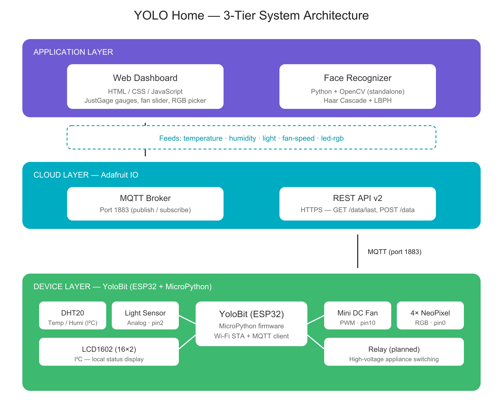
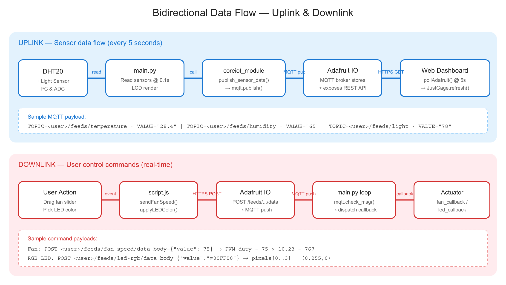
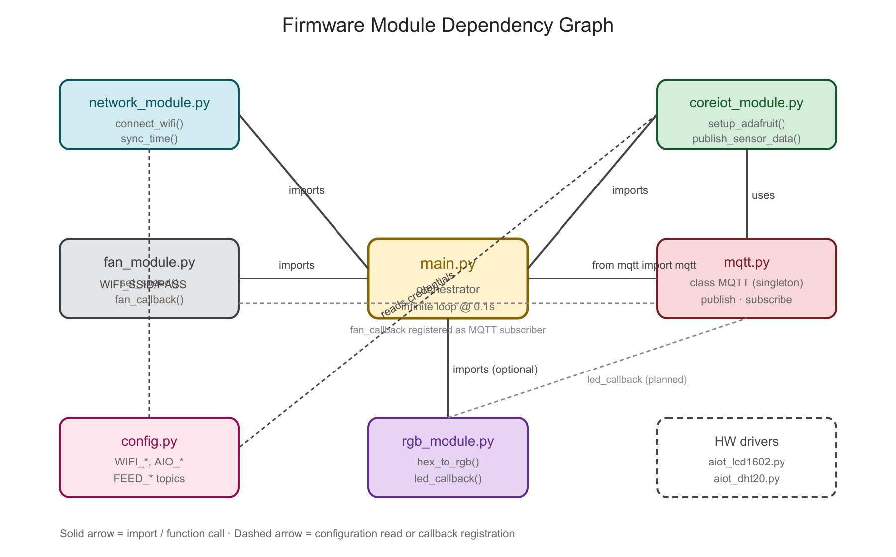
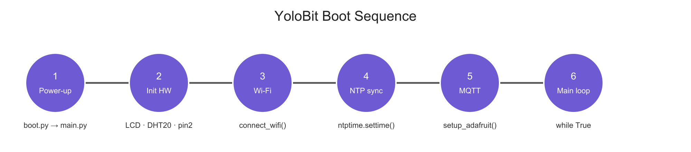
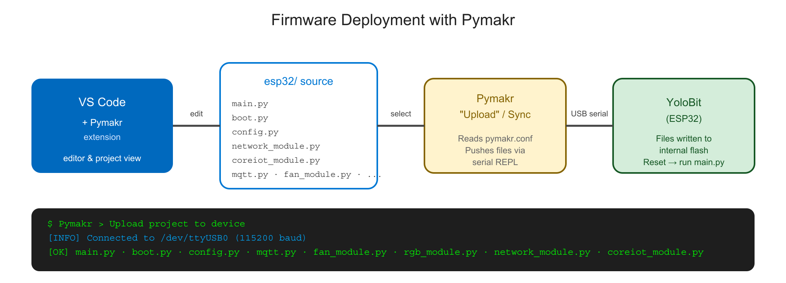

# PROJECT REPORT — YOLO HOME

## Smart home system integrating environmental monitoring, cloud-based device control, and face recognition

---

## Table of Contents

1. [Project Introduction and Functional Analysis](#1-project-introduction-and-functional-analysis)
2. [Technology Survey](#2-technology-survey)
3. [System Design](#3-system-design)
4. [Detailed Description](#4-detailed-description)
5. [Implementation](#5-implementation)

---

## 1. Project Introduction and Functional Analysis

### 1.1. Background and Objectives

With the rapid growth of the Internet of Things (IoT) and edge computing, smart home systems have become increasingly affordable and accessible to consumers. The **YOLO Home** project was built with the following goals:

- Collect **real-time environmental data** (temperature, humidity, light intensity) inside a room.
- Provide an **intuitive browser-based dashboard** for users to monitor and control devices remotely.
- Enable **bidirectional control** between physical actuators (fan, RGB LEDs) and the web UI through the Adafruit IO cloud platform.
- Integrate an additional **face recognition module** using Computer Vision, broadening the project's scope to security/identity-based use cases.

### 1.2. Scope and Main Functions

The system consists of **three main components**:

| Component | Primary Responsibilities |
|---|---|
| **YoloBit (ESP32) firmware** | Read sensors, drive LCD, connect to Wi-Fi, sync NTP, publish data over MQTT, receive fan and RGB LED commands |
| **Web Dashboard** | Display three real-time gauges, fan speed slider, RGB color picker, Adafruit IO settings form |
| **Face Recognizer** | Standalone Python module — trains an LBPH model from images and recognizes faces in video |

### 1.3. Functional Use Cases

**Use Case 1 — Environmental monitoring:** The user opens the web dashboard. The gauges update every 5 seconds via the Adafruit IO REST API. On the device side, the 16×2 LCD shows the same readings along with the NTP-synchronized clock.

**Use Case 2 — Fan speed control:** The user drags the slider on the dashboard or presses MAX/OFF. A value of 0–100 is POSTed to the `fan-speed` feed. The MQTT broker forwards the message to the YoloBit (which has subscribed), and `fan_module` converts the value to a PWM duty cycle (0–1023) on `pin10`.

**Use Case 3 — RGB LED control:** The user picks a position and color in the dashboard. A hex string (`#RRGGBB`), the keyword `ALARM`, or `"0"` is sent to the `led-rgb` feed. On the device, `rgb_module.led_callback` converts the hex string into an `(R, G, B)` tuple and refreshes the chain of 4 NeoPixels on `pin0`.

**Use Case 4 — Face recognition:** The user runs the Python script on a PC. A pre-trained LBPH model is loaded, then the input video is processed frame by frame: face detection via Haar Cascade, identity prediction via LBPH, drawing a green bounding box for known faces and red for unknown ones.

---

## 2. Technology Survey

### 2.1. Hardware — YoloBit (ESP32)

**YoloBit** is an educational board based on the ESP32 — a 32-bit dual-core Tensilica Xtensa LX6 microcontroller with built-in 2.4 GHz Wi-Fi and Bluetooth. The board exposes:

- GPIO pins mapped via objects `pin0`, `pin1`, … `pin20` in the `yolobit` module.
- An integrated I²C bus shared by the LCD1602 and DHT20.
- PWM output on most pins (through `write_analog()`).
- Support for the `neopixel` library to control WS2812B addressable LEDs.

### 2.2. Firmware — MicroPython

**MicroPython** is a lean Python 3 implementation targeted at microcontrollers. The project uses these modules:
- `network` — Wi-Fi configuration in STA mode.
- `ntptime` — NTP time synchronization.
- `umqtt.simple` — lightweight MQTT client.
- `machine`, `neopixel` — hardware access and RGB LED control.

MicroPython's advantage is a simple, expressive syntax that enables fast iteration. Its drawback is reduced performance compared to native C/C++, but it is well suited to this educational IoT scope.

### 2.3. Development Environment — Pymakr

The firmware is uploaded to the YoloBit using **Pymakr**, an open-source Visual Studio Code extension specifically designed for MicroPython development on ESP32/Pycom boards. Pymakr provides:

- A **serial REPL** terminal directly inside VS Code (115200 baud over USB).
- One-click **Upload** to sync the local project folder to the board's flash storage.
- Automatic **device discovery** for any board appearing on a serial port.
- **Hot reload** — files can be re-uploaded individually without re-flashing the entire firmware.

The project includes a `pymakr.conf` file that pins the workspace to the firmware folder, so Pymakr knows which files to upload. The deployment workflow is illustrated in section 5.11 below.

### 2.4. Communication Protocol — MQTT

**MQTT (Message Queuing Telemetry Transport)** is a lightweight publish/subscribe protocol that runs over TCP and is designed for devices with limited bandwidth and power. Key properties:

- A **central broker** model: clients publish to topics; the broker distributes messages to all subscribers.
- Very low overhead (headers can be just 2 bytes).
- Supports three QoS levels (0, 1, 2).

In this project, Adafruit IO acts as the MQTT broker on port 1883, and each feed maps to a topic of the form `<username>/feeds/<feed-name>`.

### 2.5. IoT Platform — Adafruit IO

**Adafruit IO** is a free cloud service that offers:
- Time-series storage of sensor data.
- Both an **MQTT broker** and a **REST API v2** (HTTPS).
- Authentication via `username` + `AIO Key`.

In our project, MQTT is used on the device side (YoloBit publishes and subscribes), while the REST API is used on the web side (polling and POST requests).

### 2.6. Web Frontend

| Technology | Role |
|---|---|
| **HTML5 + CSS3** | Page structure and responsive layout |
| **JavaScript (ES6+)** | Application logic, fetch API, async/await |
| **JustGage 1.3.5** | Smooth animated donut-style gauge widgets |
| **Raphael.js 2.3.0** | SVG rendering engine (JustGage dependency) |
| **Font Awesome 6.5.0** | Icon set (fan, lightbulb, user, key, …) |
| **localStorage** | Persists Adafruit IO credentials in the browser |

### 2.7. Computer Vision — OpenCV + LBPH

**OpenCV** is the de facto open-source computer vision library. The project uses:

- **Haar Cascade Classifier** (`haar_face.xml`) — a cascade-style face detector based on Haar features. It is fast and suitable for a real-time pipeline.
- **LBPH (Local Binary Pattern Histogram)** — a face recognition algorithm bundled in the `cv2.face` module (from `opencv-contrib-python`). LBPH divides the face into small grid cells, computes the local binary pattern histogram of each cell, and identifies the face by comparing histograms using chi-squared distance.

Advantages of LBPH: fast, no GPU needed, works with as few as a dozen training images per person. Disadvantage: lower accuracy compared to deep-learning approaches like FaceNet or ArcFace.

---

## 3. System Design

### 3.1. Overall Architecture (3-tier)



The system follows a classic three-tier IoT architecture:

- **Application Layer** — Web dashboard (cloud-connected) and the Face Recognizer (standalone PC application).
- **Cloud Layer** — Adafruit IO, which combines an MQTT broker and a REST API. Five feeds carry all sensor and command traffic.
- **Device Layer** — YoloBit running MicroPython, interfacing with sensors (DHT20, light sensor) and actuators (fan, RGB LEDs).

### 3.2. Data Flow



**Uplink** (every 5 seconds): sensors → `main.py` → `coreiot_module.publish_sensor_data()` → MQTT publish → Adafruit IO → REST endpoint `/data/last` → `script.js` polling → JustGage refresh.

**Downlink** (real-time): user action → `script.js` POST → Adafruit IO → MQTT push → YoloBit's `mqtt.check_msg()` → registered callback (`fan_callback` / `led_callback`) → actuator output.

### 3.3. Firmware Module Decomposition



The firmware is decomposed according to the **Single Responsibility Principle (SRP)**, making it easier to maintain and extend:

| Module | Responsibility |
|---|---|
| `config.py` | Holds all configuration constants (credentials, feed topics) |
| `network_module.py` | Wi-Fi association and NTP time synchronization |
| `mqtt.py` | Thin wrapper around the MQTT client (publish / subscribe / poll) |
| `coreiot_module.py` | Initializes the Adafruit IO connection and publishes sensor readings |
| `fan_module.py` | Fan PWM control |
| `rgb_module.py` | NeoPixel RGB LED chain control |
| `main.py` | Main loop that orchestrates all modules |

---

## 4. Detailed Description

### 4.1. Hardware Devices

| Device | Pin | Interface | Description |
|---|---|---|---|
| **DHT20** | SDA/SCL | I²C | Digital temperature & humidity sensor, accuracy ±0.5 °C / ±3 %RH |
| **LCD1602** | SDA/SCL | I²C | 16×2 character display, shows live readings and the clock |
| **Light Sensor (LDR)** | `pin2` | Analog | Reads 0–1023, mapped to a 0–100 % light intensity |
| **Mini DC Fan** | `pin10` | PWM | Speed 0–100 % controlled via PWM duty 0–1023 |
| **NeoPixel WS2812B ×4** | `pin0` | Single-wire | Chain of 4 individually-addressable RGB LEDs |

### 4.2. Adafruit IO Feeds

| Feed | Direction | Value format | Purpose |
|---|---|---|---|
| `temperature` | YoloBit → Cloud | float (°C) | Ambient temperature |
| `humidity` | YoloBit → Cloud | float (%) | Relative humidity |
| `light` | YoloBit → Cloud | int (0–100 %) | Light intensity |
| `fan-speed` | Cloud ↔ YoloBit | int (0–100) | Fan speed setpoint |
| `led-rgb` | Web → YoloBit | `#RRGGBB` / `"0"` / `"ALARM"` | RGB LED color command |

### 4.3. Device Boot Sequence



1. **Power-up** — MicroPython loads `boot.py` (empty) and then `main.py`.
2. **Hardware init** — instantiate `LCD1602`, `DHT20`, assign `light_sensor = pin2`.
3. **Wi-Fi** — `network_module.connect_wifi()` uses SSID/PASS from `config.py`; shows "Connecting WiFi" on the LCD.
4. **NTP sync** — `network_module.sync_time()` calls `ntptime.settime()`; shows "Time set up Successfully" or an error message.
5. **Adafruit IO** — `coreiot_module.setup_adafruit()` creates the MQTT client and registers the callback for the `fan-speed` feed.
6. **Main loop** — runs every 0.1 s: check MQTT messages, read sensors, render LCD, publish data every 5 s.

---

## 5. Implementation

This section walks through how each module is implemented, includes the most important code snippets, and explains how the modules cooperate.

### 5.1. Configuration Module (`config.py`)

All credentials and feed topics are centralized in a single file so that updates do not require touching any logic code:

```python
WIFI_SSID = ""
WIFI_PASS = ""

AIO_USERNAME = ""
AIO_KEY = ""
AIO_BROKER = ""
AIO_PORT = 1883

FEED_TEMP  = AIO_USERNAME + "/feeds/temperature"
FEED_HUMI  = AIO_USERNAME + "/feeds/humidity"
FEED_LIGHT = AIO_USERNAME + "/feeds/light"
FEED_FAN   = AIO_USERNAME + "/feeds/fan-speed"
FEED_RGB   = AIO_USERNAME + "/feeds/led-rgb"
```

Note: each topic is concatenated from `AIO_USERNAME` so every user automatically gets the correct namespace without editing each line.

### 5.2. Network Module (`network_module.py`)

This module isolates Wi-Fi and NTP concerns from the rest of the firmware. The key part:

```python
def connect_wifi(lcd):
    wlan = network.WLAN(network.STA_IF)
    wlan.active(True)
    if not wlan.isconnected():
        lcd.move_to(0, 0)
        lcd.putstr("Connecting WiFi ")
        wlan.connect(WIFI_SSID, WIFI_PASS)
        while not wlan.isconnected():
            print(".", end="")
            time.sleep(1)
    print("\nWiFi connected! IP:", wlan.ifconfig()[0])
    lcd.clear(); lcd.putstr("WiFi OK!")
```

`sync_time()` is called immediately after Wi-Fi succeeds, using `ntptime.settime()`. The whole function is wrapped in `try/except` so that the system still runs even if the NTP server fails to reply.

### 5.3. MQTT Wrapper (`mqtt.py`)

A minimal `MQTT` class around `umqtt.simple.MQTTClient` provides a unified interface to the rest of the firmware:

```python
class MQTT:
    def __init__(self):
        self.client = None
        self.cb = None

    def connect_ww_or_tt(self, server, port, user, pwd, client_id):
        if user == "" and pwd == "":
            self.client = MQTTClient(client_id, server, port)
        else:
            self.client = MQTTClient(client_id, server, port, user, pwd)
        self.client.set_callback(self.on_receive)
        self.client.connect()

    def publish(self, topic, message):
        if self.client:
            self.client.publish(topic, str(message))

    def on_receive(self, topic, msg):
        if self.cb:
            self.cb(topic.decode('utf-8').split('/')[-1],
                    msg.decode('utf-8'))

    def on_receive_message(self, topic, callback):
        self.cb = callback
        self.client.subscribe(topic)

    def check_msg(self):
        if self.client:
            self.client.check_msg()

mqtt = MQTT()
```

**Design note:** `on_receive` automatically decodes the topic and extracts the last path segment, so subscribers receive `"fan-speed"` instead of `"username/feeds/fan-speed"`. The module exposes a singleton `mqtt` instance, so callers simply write `from mqtt import mqtt`.

### 5.4. Adafruit IO Module (`coreiot_module.py`)

This module acts as a facade between the low-level `mqtt` wrapper and the business-level topics in `config`:

```python
def setup_adafruit(lcd):
    print("Connecting to Adafruit IO...")
    try:
        mqtt.connect_ww_or_tt(
            config.AIO_BROKER,
            config.AIO_PORT,
            config.AIO_USERNAME,
            config.AIO_KEY,
            config.AIO_USERNAME       # username used as client_id
        )
        mqtt.on_receive_message(config.FEED_FAN, fan_module.fan_callback)
        lcd.clear(); lcd.putstr("Adafruit OK!")
    except Exception as e:
        print("Error:", e)

def publish_sensor_data(temp, humi, light):
    try:
        mqtt.publish(config.FEED_TEMP,  str(temp))
        mqtt.publish(config.FEED_HUMI,  str(humi))
        mqtt.publish(config.FEED_LIGHT, str(light))
    except Exception:
        # Re-connect if the network dropped
        try:
            mqtt.connect_ww_or_tt(
                config.AIO_BROKER, config.AIO_PORT,
                config.AIO_USERNAME, config.AIO_KEY,
                config.AIO_USERNAME
            )
        except:
            pass
```

**Highlight:** `publish_sensor_data()` includes an **auto-reconnect** path — if publishing fails (a transient network drop), it immediately tries to re-establish the connection so the system doesn't hang after a single outage.

### 5.5. Fan Control Module (`fan_module.py`)

```python
from yolobit import *

current_fan_speed = 0
speed_fan_value = pin10

def set_speed(speed_input):
    global current_fan_speed
    try:
        val = int(speed_input)
        if val < 0: val = 0
        if val > 100: val = 100
        current_fan_speed = val
        duty_value = int(current_fan_speed * 10.23)
        speed_fan_value.write_analog(duty_value)
        print("Sent PWM :", duty_value)
    except Exception as e:
        print("Error in control fan:", e)

def fan_callback(topic, msg):
    print("Received command from Cloud:", msg)
    set_speed(msg)
```

**How it works:**
- `fan_callback` is registered with MQTT (see `coreiot_module.setup_adafruit`).
- When the cloud delivers a value (a string `"0"`–`"100"`), the callback invokes `set_speed`.
- The formula `duty = val × 10.23` linearly maps 0–100 % to 0–1023 (the ESP32's 10-bit PWM resolution).
- Values are **clamped** (0 ≤ val ≤ 100) to prevent PWM overflow.

### 5.6. RGB LED Module (`rgb_module.py`)

```python
from machine import Pin
import neopixel
from yolobit import *

pixels = neopixel.NeoPixel(Pin(pin0.pin), 4)

def hex_to_rgb(hex_str):
    hex_str = hex_str.lstrip('#')
    if len(hex_str) != 6:
        return (0, 0, 0)
    return tuple(int(hex_str[i:i+2], 16) for i in (0, 2, 4))

def led_callback(topic, msg):
    try:
        print("RGB command received: ", msg)
        if msg == "0" or msg == "#000000":
            color = (0, 0, 0)
        elif msg.startswith('#'):
            color = hex_to_rgb(msg)
        else:
            print("Invalid RGB format, skipping...")
            return
        for i in range(4):
            pixels[i] = color
        pixels.write()
    except Exception as e:
        print("Error in RGB: ", e)
```

**How it works:**
- A `neopixel.NeoPixel(Pin(pin0.pin), 4)` instance drives the chain of 4 WS2812B LEDs.
- `hex_to_rgb` parses a `#RRGGBB` string into an 8-bit `(R, G, B)` tuple. It returns `(0, 0, 0)` for malformed input — safe by default.
- `led_callback` handles three input shapes:
  - `"0"` or `"#000000"` → turn everything off.
  - A string starting with `#` → convert to RGB and apply.
  - Anything else → log a warning and keep the previous state.
- The `for` loop writes the same color to all 4 pixels, then `pixels.write()` flushes the buffer synchronously.

### 5.7. Main Loop (`main.py`)

```python
from yolobit import *
from aiot_lcd1602 import LCD1602
from aiot_dht20 import DHT20
import time, network_module, coreiot_module, fan_module
from mqtt import mqtt

lcd = LCD1602()
dht = DHT20()
light_sensor = pin2

lcd.clear(); print("Starting YOLO Home...")

network_module.connect_wifi(lcd)
network_module.sync_time(lcd)
coreiot_module.setup_adafruit(lcd)

last_send_time = 0
send_interval = 5

while True:
    try:
        mqtt.check_msg()                                  # (1)
        temp  = dht.dht20_temperature()
        humi  = dht.dht20_humidity()
        light = int((light_sensor.read_analog() / 1023) * 100)

        t = time.localtime(time.time() + 7 * 3600)         # (2)
        line1 = "{:>4.1f}*C {:>3d}% {:>3d}%".format(temp, int(humi), light)
        line2 = "{:02d}/{:02d}/{:04d} {:02d}:{:02d}".format(t[2], t[1], t[0], t[3], t[4])
        lcd.move_to(0, 0); lcd.putstr(line1)
        lcd.move_to(0, 1); lcd.putstr(line2)

        if time.time() - last_send_time >= send_interval:  # (3)
            coreiot_module.publish_sensor_data(temp, humi, light)
            last_send_time = time.time()

    except Exception as e:
        print("System error, retrying:", e)
    time.sleep(0.1)
```

**Four important design points:**

1. **`mqtt.check_msg()`** at the top of every iteration — guarantees that downlink commands (fan/LED) are received and dispatched in near real time (latency < 100 ms).
2. **Vietnam timezone offset (+7h)**: NTP returns UTC, so we add `7 * 3600` seconds before calling `localtime` to display local time on the LCD.
3. **Decoupled LCD render rate from publish rate**: the LCD refreshes every 0.1 s (smooth), but cloud publishing happens only every 5 s (saves bandwidth and avoids Adafruit IO rate-limits).
4. **The whole loop is wrapped in `try/except`** — a transient error (I²C glitch, dropped connection) only logs a message instead of crashing the loop.

### 5.8. Web Dashboard (`script.js`)

#### 5.8.1. Initialization and credentials

```javascript
let config = {
    user: localStorage.getItem('aio_user') || "",
    key:  localStorage.getItem('aio_key')  || ""
};

window.addEventListener('load', function () {
    initGauges();
    updateClock();
    setInterval(updateClock, 1000);
    if (config.user && config.key) {
        pollAdafruit();
        setInterval(pollAdafruit, 5000);     // 5-second polling
    }
});
```

Credentials are kept in `localStorage` so the user only enters them once. Polling starts immediately on page load if credentials are already saved.

#### 5.8.2. Sensor polling

```javascript
async function pollAdafruit() {
    if (!config.user || !config.key) return;
    const feeds = ["temperature", "humidity", "light", "fan-speed"];
    for (let feed of feeds) {
        try {
            const url = `https://io.adafruit.com/api/v2/${config.user}/feeds/${feed}/data/last`;
            const response = await fetch(url, { headers: { "X-AIO-Key": config.key } });
            if (response.ok) {
                const data = await response.json();
                const val = parseFloat(data.value);
                if (feed === "temperature") window.gaugeTemp.refresh(val);
                if (feed === "humidity")    window.gaugeHumi.refresh(val);
                if (feed === "light")       window.gaugeLight.refresh(val);
                if (feed === "fan-speed")   updateFanUI(val);
            }
        } catch (e) { console.error("Failed to fetch feed " + feed, e); }
    }
}
```

Every 5 seconds the dashboard fetches `/data/last` from each feed and updates the corresponding gauge. The `/data/last` endpoint always returns the most recent value, so we avoid downloading any history.

#### 5.8.3. Sending control commands

```javascript
async function sendFanSpeed(speed) {
    if (!config.user || !config.key) return alert("Error! Please try again");
    updateFanUI(speed);                                  // optimistic UI
    try {
        await fetch(`https://io.adafruit.com/api/v2/${config.user}/feeds/fan-speed/data`, {
            method: 'POST',
            headers: { "X-AIO-Key": config.key, "Content-Type": "application/json" },
            body: JSON.stringify({ value: speed })
        });
    } catch (e) { console.error("Fan command failed", e); }
}
```

**Optimistic UI:** as soon as the user moves the slider, the UI updates immediately without waiting for the cloud round-trip — the experience stays smooth.

#### 5.8.4. Speed-dependent fan animation

```javascript
function updateFanUI(speed) {
    const val = parseInt(speed);
    document.getElementById('fan-slider').value = val;
    document.getElementById('fan-speed-text').innerText = val;
    const icon = document.getElementById('fan-icon');
    if (val > 0) {
        icon.classList.add('fan-on');
        const duration = 2 - (val / 100 * 1.8);          // 0.2s → 2s
        icon.style.animationDuration = duration + "s";
    } else {
        icon.classList.remove('fan-on');
    }
}
```

The CSS animation duration is inversely proportional to the slider value — at 100 % the icon completes a rotation in 0.2 s, at 1 % it takes 1.98 s. This gives an intuitive visual cue of the fan's actual speed.

#### 5.8.5. Gauge initialization

```javascript
function initGauges() {
    const common = {
        min: 0, max: 100, donut: true, pointer: false,
        gaugeWidthScale: 0.2, gaugeColor: "#f0f0f0", counter: true
    };
    window.gaugeTemp  = new JustGage({ id: "gauge_temp",  value: 0, ...common,
        symbol: "°C", levelColors: ["#00BCD4", "#FFC107", "#F44336"] });
    window.gaugeHumi  = new JustGage({ id: "gauge_humi",  value: 0, ...common,
        symbol: "%",  levelColors: ["#E1F5FE", "#42A5F5", "#01579B"] });
    window.gaugeLight = new JustGage({ id: "gauge_light", value: 0, ...common,
        symbol: "%",  levelColors: ["#333333", "#FFD700", "#FFFF00"] });
}
```

Each gauge has its own gradient color scale — temperature transitions blue → yellow → red, humidity light-blue → deep-blue, light dark → bright-yellow.

### 5.9. Face Recognizer

#### 5.9.1. Training (`face_regconition_train.py`)

```python
people = ['Ben Afflek', 'Chris Evan', 'Christian Bale']
haar_cascade = cv.CascadeClassifier('haar_face.xml')

def get_faces_and_labels(faces_folder_path):
    features, labels = [], []
    for person in people:
        img_folder_path = os.path.join(faces_folder_path, person)
        label = people.index(person)
        for img in os.listdir(img_folder_path):
            img_path = os.path.join(img_folder_path, img)
            img_matrix = cv.imread(img_path)
            if img_matrix is None: continue
            gray = cv.cvtColor(img_matrix, cv.COLOR_BGR2GRAY)
            gray = cv.GaussianBlur(gray, (3, 3), 0)
            gray = cv.equalizeHist(gray)
            faces_rect = haar_cascade.detectMultiScale(gray, 1.1, minNeighbors=4)
            for x, y, w, h in faces_rect:
                features.append(gray[y:y+h, x:x+w])
                labels.append(label)
    return features, labels

features, labels = get_faces_and_labels(r"Faces\train")
features = np.array(features, dtype='object')
labels   = np.array(labels)

face_recognizer = cv.face.LBPHFaceRecognizer.create(radius=1, neighbors=8, grid_x=4, grid_y=4)
face_recognizer.train(features, labels)
face_recognizer.write('face_recognizer_model.yml')
```

**Training image preprocessing pipeline:**
1. **Grayscale** — LBPH only operates on the intensity channel.
2. **GaussianBlur (3×3)** — reduces noise.
3. **equalizeHist** — histogram equalization, which makes Haar features stand out.
4. **Haar Cascade** with `scaleFactor=1.1`, `minNeighbors=4` — crops the face region.
5. Append the face region to `features` and its index to `labels`.

**LBPH parameters:** `radius=1, neighbors=8` (8 neighboring pixels at radius 1), `grid_x=4, grid_y=4` (the face is split into 16 cells for local histograms).

#### 5.9.2. Live Recognition (`face_recognizer.py`)

```python
face_recognizer = cv.face.LBPHFaceRecognizer.create(radius=1, neighbors=8, grid_x=4, grid_y=4)
face_recognizer.read("face_recognizer_model.yml")

vid = cv.VideoCapture(Christian_Bale)
while True:
    isTrue, frame = vid.read()
    if not isTrue: break
    frame = resize(frame, scale=0.7)
    gray  = cv.cvtColor(frame, cv.COLOR_BGR2GRAY)
    faces = haar_cascade.detectMultiScale(gray, 1.1, 6)
    for (x, y, w, h) in faces:
        roi = gray[y:y+h, x:x+w]
        label, confidence = face_recognizer.predict(roi)
        if confidence < 10:
            name, color = people[label], (0, 255, 0)
        else:
            name, color = "Unknown", (0, 0, 255)
        cv.putText(frame, f"{name} ({int(confidence)})", (x, y - 10),
                   cv.FONT_HERSHEY_COMPLEX, 0.6, color, 2)
        cv.rectangle(frame, (x, y), (x+w, y+h), color, 2)
    cv.imshow('Live face recognition', frame)
    if cv.waitKey(20) & 0xFF == ord('d'): break
```

**Per-frame procedure:**
1. Read a frame, resize to 70 % for performance.
2. Convert to grayscale, detect with Haar (`minNeighbors=6` — stricter than at training time to reduce false positives on live video).
3. For each detected face: `predict()` returns `(label, confidence)`. **Note**: LBPH uses chi-squared distance, so **lower confidence = better match**.
4. Threshold `confidence < 10` — tight match (very confident). Above 10 is treated as "Unknown".
5. Draw a green box + name for known faces, a red box + "Unknown" for strangers.

### 5.10. Module Cooperation

The way modules interact is best captured by the two flows in section 3.2 (uplink and downlink). Here are the more detailed call chains:

**"Sensor → Cloud → Dashboard" flow:**
```
DHT20  ──(I²C)──► main.py ──┐
LightS ──(ADC)──► main.py ──┤── publish_sensor_data() ──► mqtt.publish() ──► Adafruit IO
                            │                                                       │
                            └── LCD render in parallel                               │
                                                                                    ▼
                                                          script.js pollAdafruit() ◄┘
                                                                    │
                                                                    ▼
                                                              JustGage refresh()
```

**"User → Cloud → Device" flow:**
```
User drags slider (HTML) ──► script.js sendFanSpeed()
                                     │
                                     ▼ POST /feeds/fan-speed/data
                              Adafruit IO broker
                                     │
                                     ▼ MQTT push to subscriber
                          main.py mqtt.check_msg()
                                     │
                                     ▼ trigger the registered callback
                              fan_module.fan_callback()
                                     │
                                     ▼ set_speed → write_analog
                                  Fan adjusts speed
```

The same pattern applies to `led-rgb`: web → `applyLEDColor()` → POST → broker → `rgb_module.led_callback` → `pixels.write()`.

**Key design takeaway:** both uplink and downlink pass through a **single broker** (Adafruit IO), so:
- The device and the dashboard are fully decoupled — either can be offline while the other still logs to the cloud.
- A third client (e.g. a mobile app) can be added simply by subscribing to the same feeds; no firmware changes required.
- All state is retrievable from the cloud (temperature history, last command sent, etc.).

### 5.11. Deployment with Pymakr

The firmware is deployed to the YoloBit using the **Pymakr** VS Code extension. The full workflow is illustrated below:



**Step-by-step deployment:**

1. **Install Pymakr** — open VS Code → Extensions → search "Pymakr" → install. The extension auto-detects ESP32-class boards on serial ports.

2. **Open the project** — open the `esp32/` folder as the workspace. The included `pymakr.conf` already tells Pymakr that this folder is the project root.

3. **Connect the YoloBit** — plug the board into a USB port. Pymakr opens a status-bar indicator and shows the device under "Connected boards".

4. **Configure credentials** — edit `config.py` and fill in your `WIFI_SSID`, `WIFI_PASS`, `AIO_USERNAME`, `AIO_KEY`, and `AIO_BROKER`.

5. **Upload** — open the Pymakr command palette and run **"Upload project to device"** (or click the "Upload" button on the status bar). Pymakr copies every file in `esp32/` to the board's flash storage via the serial REPL at 115200 baud.

6. **Reset and run** — Pymakr automatically issues a soft reset after upload. The YoloBit reboots, loads `boot.py`, then `main.py`, and the system starts immediately.

7. **Live debugging** — Pymakr's built-in REPL terminal shows all `print()` output in real time. This is invaluable for tracing `Connecting to Adafruit IO...`, `Sent PWM : 767`, or `RGB command received: #00ff00` messages.

**Why Pymakr?** Compared to other tools (esptool.py for native flashing, Thonny, ampy), Pymakr offers the smoothest iterative workflow: a single keystroke re-uploads the entire project, the REPL is integrated with the editor, and the configuration file (`pymakr.conf`) is version-controllable.

---

## Conclusion

The YOLO Home project demonstrates a complete three-tier IoT architecture: **embedded device → cloud → user interface**, supplemented by a standalone computer-vision module. Its primary strengths are:

- **Clear modularization** — every firmware module has a single responsibility, making it easy to test and extend.
- **Asynchronous bidirectional communication via MQTT/REST** — minimizes coupling between the device and the UI.
- **Auto-reconnect and pervasive `try/except`** — the system is resilient against transient network failures.
- **Optimistic UI with 5-second polling** — smooth user experience while staying within cloud rate-limits.
- **LBPH-based Face Recognizer** — runs without GPU, deployable on any commodity laptop.
- **Pymakr-driven workflow** — fast iteration cycle and version-controllable deployment configuration.

Future work could include: integrating the Face Recognizer with the firmware (sending an MQTT alert when an unknown face is detected), adding relay control for 230 V appliances, and supporting an Access Point setup mode so first-time Wi-Fi configuration does not require editing `config.py`.
